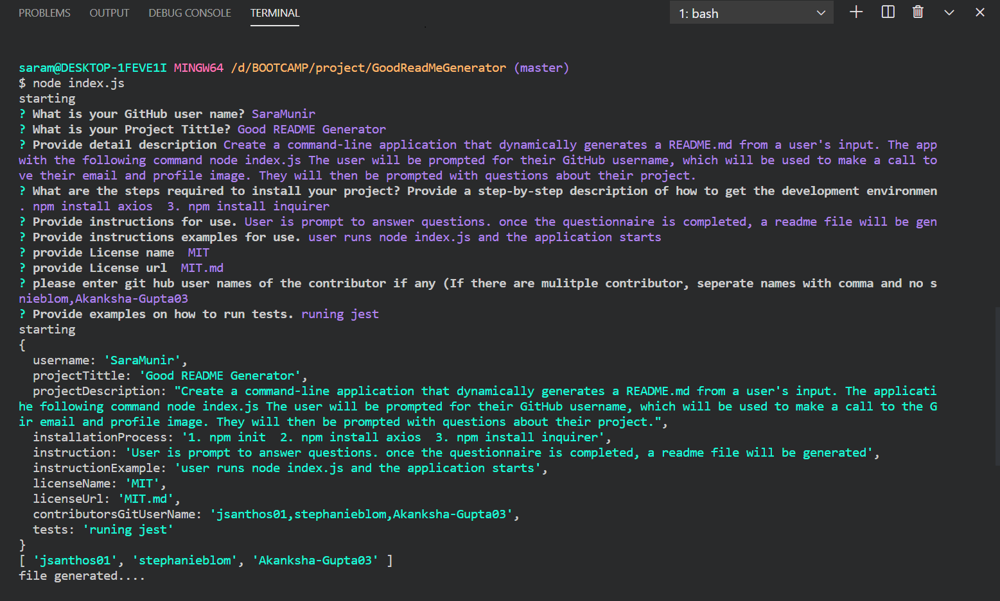
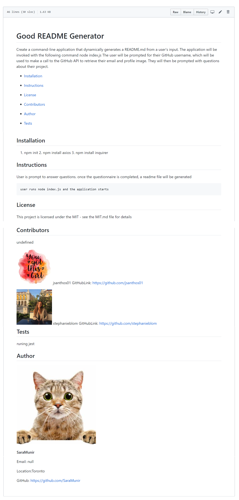

# Good README Generator 
Create a command-line application that dynamically generates a README.md from a user's input. The application will be invoked with the following command node index.js The user will be prompted for their GitHub username, which will be used to make a call to the GitHub API to retrieve their email and profile image. They will then be prompted with questions about their project.

* [Installation](#Installation)

* [Instructions](#Instructions)

* [License](#License)

* [Contributors](#Contributors)

* [Author](#Author)

* [Tests](#Tests)

## Installation
1. npm init  2. npm install axios  3. npm install inquirer
## Instructions
User is prompt to answer questions. once the questionnaire is completed, a readme file will be generated
```
user runs node index.js and the application starts
```
## License 
This project is licensed under the MIT - see the MIT.md file for details
### Terminal Screen Shot

### Terminal Screen Shot

## Author 

**SaraMunir**

Email: null

Location:Toronto

GitHub: https://github.com/SaraMunir
